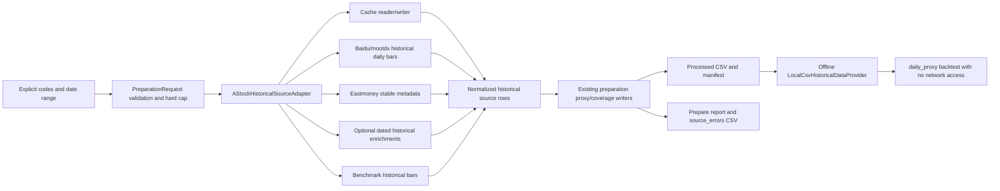

# Phase 3.2b-2 Bounded A-Stock-Data Historical Preparation Design

## Purpose

Phase 3.2b-2 designs a bounded network-backed preparation source for existing
`daily_proxy` research:

```text
prepare_backtest_data.py --source a-stock-data
  -> processed CSV + dataset_manifest.yaml
  -> LocalCsvHistoricalDataProvider
  -> offline daily_proxy backtest
```

This phase is design only. It does not implement an adapter and does not issue
network requests.

The future source is deliberately restricted to a user-supplied, small stock
pool and an explicit date range. It is not a full-market collector. Prepared
data remains `DAILY_PROXY` research and cannot be described as
`strict_historical` validation of `yang_yongxing_overnight_v1`.

## Non-Goals And Safety Boundary

Phase 3.2b-2 does not design or permit:

- automatic order placement, broker API execution, or broker-software clicks;
- GUI features, machine learning, or parameter brute-force optimization;
- networking inside `run_backtest.py` or any backtest iteration;
- implicit all-market discovery or an unattended large-scale downloader;
- current live quote, current theme, or current capital data written into
  historical selection rows;
- reuse of `positive` profile `sample_fixture` fields for real
  `a-stock-data` preparation;
- claims that `daily_proxy` results prove profitability or complete historical
  behavior.

## Design Decision

Three adapter shapes were considered:

| Approach | Description | Trade-off |
| --- | --- | --- |
| A. Bounded preparation-only adapter | Fetch a small explicit pool outside the backtest loop, cache raw responses, prepare audited local files | Best auditability and preserves existing offline backtest boundary; chosen |
| B. Provider-side network fallback | Let `LocalCsvHistoricalDataProvider` fetch missing values during backtest | Smaller initial adapter, but violates offline reproducibility and no-future-data auditing |
| C. Broad collector and local warehouse | Collect large historical universes before selecting a research sample | Useful later, but outside current safety and rate-limit scope |

The selected approach is **A**. Network access exists only in a future
preparation source adapter; processed output remains the sole input to
`daily_proxy`.

## Command Contract

The future command is:

```text
python overnight_quant/scripts/prepare_backtest_data.py \
  --source a-stock-data \
  --codes 300001,600519 \
  --start 2025-01-01 \
  --end 2025-01-31 \
  --out-dir overnight_quant/backtest_data/processed \
  --max-codes 10 \
  --sleep 0.5 \
  --overwrite
```

### Arguments

| Argument | Contract |
| --- | --- |
| `--source a-stock-data` | Selects bounded historical preparation; not available until implementation phase |
| `--codes` / `--codes-file` | One is required; no implicit universe expansion |
| `--start` / `--end` | Both required; inclusive historical interval |
| `--out-dir` | Existing non-empty output is rejected unless `--overwrite` is present |
| `--max-codes` | For this source, default is `10`; user may lower it but cannot exceed the hard limit |
| `--sleep` | Minimum permitted value is `0.2` seconds; default recommendation is `0.5` seconds |
| `--dry-run` | Validates plan, limits, paths, and cache plan only; performs zero network calls and writes no processed dataset |
| `--no-cache` | Optional future flag for forced refresh of eligible cached responses; disabled by default |

### Hard Code Limit

`--source a-stock-data` has a first-version hard limit of **10 codes**.

```text
LIVE_PREP_HARD_MAX_CODES = 10
effective_max_codes = min(user_max_codes, LIVE_PREP_HARD_MAX_CODES)
```

Rules:

- If `--max-codes` is omitted, its effective value for this source is `10`.
- If the user supplies `--max-codes 1` through `--max-codes 10`, that smaller
  value is enforced.
- If the user supplies `--max-codes` greater than `10`, it does not raise the
  hard limit; the effective maximum remains `10`.
- If input `codes` count exceeds `effective_max_codes`, preparation fails
  immediately with:

```text
MAX_CODES_EXCEEDS_LIVE_PREP_LIMIT
```

- It never truncates, reorders, or silently selects a subset.
- `--dry-run` performs the same limit check and returns the same error without
  touching the network.
- Failure reporting records both `requested_codes_count` and
  `effective_max_codes`.
- Any future expansion must be an explicit reviewed configuration or command
  contract change. It is never enabled by a new default.

## Architecture

The current preparation service remains the orchestration boundary:



### Planned Components

| Component | Responsibility | Implementation Phase |
| --- | --- | --- |
| `scripts/prepare_backtest_data.py` | Parse `a-stock-data` options, enforce cap/sleep/dry-run contract | 3.2b-2b |
| `backtest/data_preparation.py` | Extend request/result and audit format without changing daily-proxy trading logic | 3.2b-2b |
| `backtest/preparation_sources.py` or a focused adjacent module | Add bounded source protocol integration | 3.2b-2b |
| `backtest/astock_historical_source.py` | Historical network adapter with injected client, cache, retry and source errors | 3.2b-2b |
| `data/astock_client.py` | Source endpoint code may be reused or extracted only where suitable for historical fetching | 3.2b-2b/2c |
| `backtest_data/cache/` | Ignored raw-response cache for historical preparation only | 3.2b-2b |
| `backtest/historical_data.py` | Existing local processed consumer; no networking changes | Unchanged |
| `backtest/backtest_engine.py` | Existing offline event processing | Unchanged |

The future adapter is injected behind a narrow client protocol in tests, so
3.2b-2b can validate transformation and failure handling with mock responses
without performing network requests.

## Verified Existing Repository Capabilities

This design relies only on abilities documented in the local
`SKILL.md`/`README.md` or currently encapsulated by
`overnight_quant/data/astock_client.py`.

| Capability | Existing documented entry point | Historical preparation use |
| --- | --- | --- |
| Stock daily K-line with dated OHLCV and optional MA5/10/20 | Baidu stock quotation K-line (`baidu_kline_with_ma`; `_baidu_daily_kline`) | Primary daily-bar candidate when response contains requested historical dates |
| Stock daily K-line alternate source | `mootdx.quotes.Quotes.bars(category=4)` | Fallback daily bars for requested codes/date coverage, subject to availability and mapping audit |
| Current quote fields including turnover, float cap and price limits | Tencent quote (`tencent_quote`; `_tencent_quotes`) | **Not** a historical row source; must never fill historical dates unless a future dated-history endpoint is separately verified |
| Stock name, float shares/cap and listing date | Eastmoney `push2` stock info (`eastmoney_stock_info`; `_eastmoney_stock_info`) | Stable instrument metadata: code/name/list date; float cap is not assumed historical point-in-time |
| Dated daily capital-flow history | Eastmoney `push2his` `stock_fund_flow_120d`; `_eastmoney_fund_flow_daily` | Optional only for matching historical dates, with coverage disclosure |
| Current/dated daily hot reason | THS hot-reason endpoint | Deferred by default; only admissible later if queried for and verified against each requested date |
| Benchmark/index quote | Tencent is currently real-time only | Not used as history; benchmark requires dated K-line source via Baidu/mootdx or remains unavailable |

### Important Source Exclusions

- Current Tencent quote data is useful for live scanning, but it is not a
  historical time series. Its current `turnover_pct`, `float_mcap_yi`,
  `limit_up`, and `limit_down` must not be placed on earlier dates.
- Current Tencent quote state and current Eastmoney/name-based `ST`, `*ST`,
  `退`, or `退市` indicators may be retained in request diagnostics as current
  warnings. They cannot confirm that a stock had the same safety status on an
  earlier `trade_date`, and therefore cannot clear historical safety gates.
- Existing live fallback-to-demo behavior is not used by historical
  preparation. A network failure is an audited source error, never a silent
  demo substitution.
- The positive fixture profile is for deterministic pipeline testing only and
  is completely unavailable to `--source a-stock-data`.

## Processed Output Contract

The future adapter writes the same five processed files already consumed by
the local daily-proxy path:

```text
overnight_quant/backtest_data/processed/
  daily_bars.csv
  selection_snapshots.csv
  market_snapshots.csv
  benchmark_bars.csv
  dataset_manifest.yaml
```

Generated audit files continue under:

```text
overnight_quant/backtest_data/manifests/
  prepare_report_YYYYMMDD_HHMMSS.md
  field_coverage_YYYYMMDD_HHMMSS.csv
  source_errors_YYYYMMDD_HHMMSS.csv
```

These paths are runtime data and remain ignored by Git.

## Field Truth Classification

Each output field receives one of these truth classes:

| Level | Meaning | Allowed Examples |
| --- | --- | --- |
| `REAL_HISTORICAL` | Value is returned for the specific historical trade date by an identified source, or is stable security metadata explicitly classified as such | Dated OHLCV from Baidu/mootdx; dated Eastmoney historical fund flow; `list_date` as stable metadata |
| `DAILY_PROXY` | Value is deterministically derived from historical daily rows and is not an intraday observation | `change_pct`, moving averages, `vol_ratio`, `range_position`, `benchmark_direction_proxy`, code-prefix BSE inference |
| `SAMPLE_FIXTURE` | Deterministic committed fixture input for test-only profiles | Only `--source sample --sample-profile positive`; prohibited for `a-stock-data` |
| `UNAVAILABLE` | Value cannot be supported historically by admitted data sources | Missing historical theme/capital/tail fields; missing benchmark |
| `UNKNOWN` | A required safety value was requested but could not be confirmed; causes conservative downstream rejection | `limit_up`, `limit_down`, `is_st`, `is_suspended`, or `list_date` when uncertain |

Truth classes are recorded in the manifest and field coverage audit. A field
may have different row-level coverage statuses across the dataset; the report
counts each class and names its source.

## Field Mapping And Missing-Value Rules

### `daily_bars.csv`

| Field | Preferred Source | Truth Level | Missing Behavior |
| --- | --- | --- | --- |
| `trade_date` | Dated historical K-line row | `REAL_HISTORICAL` | Discard row, log error |
| `code` | Requested code | `REAL_HISTORICAL` request identity | Discard malformed record |
| `name` | Eastmoney stable metadata, otherwise historical source name if supplied | `REAL_HISTORICAL` metadata | Blank is tolerated only if downstream contract permits; report coverage |
| `open`, `high`, `low`, `close`, `volume`, `amount` | Baidu K-line primary; mootdx fallback | `REAL_HISTORICAL` | Discard unusable row and log source error |
| `turnover_pct` | Only a verified dated historical source | `REAL_HISTORICAL` or `UNAVAILABLE` | Blank; may reduce candidate eligibility |
| `change_pct` | Same-code prior historical close calculation | `DAILY_PROXY` | Blank on first observation |
| `float_mcap_yi` | Only verified historical point-in-time field | `REAL_HISTORICAL` or `UNAVAILABLE` | Blank; do not use current Eastmoney/Tencent cap |
| `limit_up`, `limit_down` | Verified historical price-limit field, or expressly enabled price-limit proxy | `REAL_HISTORICAL`, `DAILY_PROXY`, or `UNKNOWN` | Blank on uncertainty; safety gate rejects |
| `is_st` | Verified dated historical status only | `REAL_HISTORICAL` or `UNKNOWN` | Blank; safety gate rejects |
| `is_suspended` | Dated status, or documented zero-trading dated marker | `REAL_HISTORICAL` or `UNKNOWN` | Blank; safety gate rejects |
| `list_date` | Eastmoney stock info metadata | `REAL_HISTORICAL` stable metadata or `UNKNOWN` | Blank; safety gate rejects |
| `is_bj_stock` | Code prefix rule | `DAILY_PROXY` | Always derived and disclosed |
| `ma5`, `ma10`, `ma20` | Dated Baidu MA values or calculation over dated historical closes | `REAL_HISTORICAL` if returned; otherwise `DAILY_PROXY` | Calculate only from current/past bars |

### `selection_snapshots.csv`

| Field | Rule For `a-stock-data` | Truth Level |
| --- | --- | --- |
| `trade_date`, `code` | Join key from daily bars | `REAL_HISTORICAL` identity |
| `vol_ratio` | Today's historical volume divided by preceding five available historical volumes | `DAILY_PROXY` |
| `range_position` | `(close - low) / (high - low)` from same date's daily OHLC | `DAILY_PROXY` |
| `tail_pullback_pct` | Leave blank unless a future verified point-in-time minute source is designed | `UNAVAILABLE` in first implementation |
| `theme_tags`, `theme_rank`, `same_theme_strong_count` | Leave blank in first implementation | `UNAVAILABLE` |
| `main_net`, `big_order_net` | Default blank; optional only if dated `push2his` rows are deliberately enabled and matched to the trade date | `UNAVAILABLE` by default; `REAL_HISTORICAL` only with matching source row |
| `theme_source` | Blank for first implementation | `UNAVAILABLE` |
| `capital_source` | Blank unless dated historical fund-flow support is explicitly enabled; then `eastmoney_push2his` | `UNAVAILABLE` or source label |
| `source_quality` | `a_stock_data_daily_proxy` plus source/coverage detail | Preparation audit label |

No current live theme or live fund-flow result may fill any historical
selection date. No `sample_fixture` values may enter this source path.

## Price-Limit And Safety Strategy

Safety accuracy is more important than producing trades.

### Default First Implementation

Unless the future adapter receives a verified historical field or an
explicitly enabled safe rule with all required dated status inputs:

- `limit_up` remains blank;
- `limit_down` remains blank;
- downstream rejection reason is `limit_price_unknown`.

`is_st` and `is_suspended` follow the same conservative rule:

- current name containing `ST` or current quote state is not sufficient to
  establish a prior trade-date status;
- if dated status is unavailable, write blank/unknown;
- downstream reasons remain `st_status_unknown` and
  `suspended_status_unknown`.

`list_date` differs because it is stable metadata once retrieved from
Eastmoney stock info:

- parse and store the source value with metadata attribution;
- derive new-stock age at each historical trade date downstream;
- if metadata fetch or parse fails, keep it blank and record
  `list_date_missing`.

### Optional Price-Limit Proxy

A later opt-in rule may be designed only when it can classify, for each
historical date:

- board regime (main board, ChiNext, STAR, BSE, ETF category);
- historical ST treatment;
- applicable reform dates or instrument-specific exceptions.

Such values must be marked `limit_price_proxy` / `DAILY_PROXY` in the
manifest and field coverage report. They must never be silently treated as
real historical price-limit data or introduced merely to increase trade
counts.

## Daily K-Line And Benchmark Sources

### Individual Securities

Priority order:

1. **Baidu stock quotation K-line**
   - Existing documented ability returns daily rows with dated OHLCV/amount
     and optional MA values.
   - Rows are retained only when their dates fall within the requested range.
2. **mootdx daily bars**
   - Alternate historical daily bars via `Quotes.bars(category=4)`.
   - Used only when Baidu is unavailable or incomplete for a requested code,
     and the fallback choice is audited.
3. **Local raw fallback**
   - Optional future retry input for manually retained raw files, separate
     from a successful network source classification.

The source adapter stores which provider populated each code's accepted daily
rows and whether fallback occurred.

### Benchmark

Preferred symbols:

1. `sh000300` / CSI 300;
2. `sh000001` / SSE Composite;
3. `sz399006` / ChiNext only when explicitly configured.

The local toolkit documents Tencent index/ETF *current* quote support, but
does not by itself establish a verified dated historical benchmark endpoint.
During implementation, Baidu/mootdx benchmark K-line support is a candidate
to verify with mocked contracts first and then a bounded real check; until
verified, benchmark remains unavailable. Current Tencent index quote is not
historical input.
If no historical benchmark is obtained:

- write an empty `benchmark_bars.csv`;
- do not invent `market_snapshots.csv` rows;
- manifest marks benchmark `UNAVAILABLE`;
- downstream `daily_proxy` keeps affected days in cash with
  `market_data_unavailable`.

## Market Snapshot Strategy

Full historical market sentiment is not reconstructed in this source.

When benchmark bars are available, preparation derives:

```text
market_gate = PASS if benchmark direction > 0 else FAIL
market_reason = benchmark_direction_proxy | benchmark_direction_proxy_non_positive
market_proxy_used = true
```

Classification:

| Field | Truth Level |
| --- | --- |
| Dated benchmark OHLC | `REAL_HISTORICAL` |
| Derived `index_change_pct` | `DAILY_PROXY` |
| Derived `market_gate` | `DAILY_PROXY` |
| `market_proxy_used` | `DAILY_PROXY` disclosure |

Reports explicitly state that this is daily benchmark direction, not actual
tail-session breadth, hotspot, northbound, or market-emotion reconstruction.

## Manifest Design

The future manifest preserves current top-level keys and adds source/audit
metadata:

```yaml
dataset: astock_data_daily_proxy_2025-01-01_2025-01-31
created_at: "2026-05-27T14:00:00+08:00"
start: 2025-01-01
end: 2025-01-31
codes_count: 2
requested_codes_count: 2
effective_max_codes: 10
source: a-stock-data
fidelity: daily_proxy
data_fidelity: daily_proxy
selection_as_of: daily_close_proxy
strict_historical_supported: false
network_prepared: true
backtest_network_access: false

truth_levels:
  REAL_HISTORICAL: dated source rows or disclosed stable metadata
  DAILY_PROXY: daily-row derivations
  SAMPLE_FIXTURE: prohibited_for_a_stock_data
  UNAVAILABLE: not historically supported
  UNKNOWN: unresolved safety value

sources:
  daily_bars:
    preferred_source: baidu_daily_kline
    fallback_sources:
      - mootdx_daily_kline
    truth_level: REAL_HISTORICAL
  security_metadata:
    source: eastmoney_stock_info
    stable_fields:
      - name
      - list_date
  selection_snapshots:
    source: daily_bar_derivations
    proxy_fields:
      - vol_ratio
      - range_position
    unavailable_fields:
      - tail_pullback_pct
      - theme_tags
      - theme_rank
      - main_net
      - big_order_net
  market_snapshots:
    source: benchmark_direction_proxy
    proxy_fields:
      - market_gate
      - index_change_pct
  benchmark_bars:
    source: verified_dated_index_kline_or_unavailable

warnings:
  - DAILY_PROXY_ONLY
  - NOT_STRICT_HISTORICAL
  - HISTORICAL_PREPARATION_USED_NETWORK_OUTSIDE_BACKTEST
  - NO_INTRADAY_TAIL_DATA_IF_APPLICABLE
  - NO_HISTORICAL_THEME_IF_APPLICABLE
  - NO_HISTORICAL_FUND_FLOW_IF_APPLICABLE
  - CURRENT_LIVE_VALUES_NOT_USED_FOR_HISTORICAL_BACKFILL
```

If dated Eastmoney fund-flow support is later enabled for the bounded adapter,
the manifest replaces only applicable capital unavailable declarations with a
dated `REAL_HISTORICAL` source and reports actual row coverage. It still does
not upgrade the whole dataset to `strict_historical`.

## Preparation Report And Error Audit

### `prepare_report_*.md`

The report must include:

1. request mode and exact command arguments;
2. requested code list and `requested_codes_count`;
3. `LIVE_PREP_HARD_MAX_CODES: 10` and `effective_max_codes`;
4. requested inclusive date range;
5. output and cache paths;
6. per-source attempt, success, empty-result, fallback, and failed counts;
7. network-error summary and retry counts;
8. field coverage and truth-level totals;
9. proxy fields and formula labels;
10. unavailable fields;
11. unknown safety field counts and candidates/dates impacted by those
    unknowns;
12. whether a dataset was written and whether it is readable by
    `daily_proxy`;
13. explicit text that no network access occurs inside backtest;
14. explicit text that results are `DAILY_PROXY` only and cannot be used as
    `strict_historical` validation or evidence of profitability.

For `MAX_CODES_EXCEEDS_LIVE_PREP_LIMIT`, the failure report still records:

```text
requested_codes_count: <actual count>
effective_max_codes: <configured value capped at 10>
LIVE_PREP_HARD_MAX_CODES: 10
network_requests_made: 0
```

### `field_coverage_*.csv`

The current coverage schema can be extended with source truth detail:

```text
table
field
present_rows
total_rows
coverage_pct
classification
source_or_formula
```

Classification values include the five truth levels. `UNKNOWN` safety fields
remain visible even if blank rather than being omitted from audit output.

### `source_errors_*.csv`

The a-stock-data source requires this normalized error schema:

```text
code
source
stage
error_code
error_message
retry_count
```

Example stages:

| Stage | Example Source |
| --- | --- |
| `daily_bars_primary` | `baidu_daily_kline` |
| `daily_bars_fallback` | `mootdx_daily_kline` |
| `metadata` | `eastmoney_stock_info` |
| `capital_optional` | `eastmoney_push2his` |
| `benchmark` | `baidu_index_kline` |
| `validation` | `request_limit` |

Source error entries are written for validation failures as well as attempted
network sources, allowing dry-run cap rejection to be audited without network
activity.

## Caching Design

### Cache Directory

Future preparation cache location:

```text
overnight_quant/backtest_data/cache/a_stock_data/
```

It is ignored by Git and separate from live scan cache and processed output.

### Cache Keys

Each raw fetch type uses a deterministic key:

```text
<source>/<endpoint_version>/<symbol>/<start>_<end>/<request_hash>.json
```

Examples:

```text
baidu_daily_kline/v1/300001/2025-01-01_2025-01-31/<hash>.json
mootdx_daily_kline/v1/600519/2025-01-01_2025-01-31/<hash>.json
eastmoney_stock_info/v1/300001/metadata/<hash>.json
baidu_index_kline/v1/sh000300/2025-01-01_2025-01-31/<hash>.json
```

The request hash includes normalized parameters that affect returned data,
not credentials or machine-local paths.

### Cache Validity

| Data Type | Expiry Strategy |
| --- | --- |
| Completed historical K-line interval ending before current trade date | Immutable-by-default cache; refresh only with `--no-cache` or explicit overwrite/refresh policy |
| Stable listing metadata | Long-lived cache, e.g. 30 days, with recorded retrieved timestamp |
| Interval including current date | Not admitted for historical preparation in the first real-request phase, or forced short expiry with explicit incomplete-data warning |
| Source errors | Not reused as success; may be recorded alongside a subsequent successful retry |

To avoid incomplete current-session bars, Phase 3.2b-2c should test only an
interval ending before the run date.

### `--no-cache`

`--no-cache` is useful but not required for adapter skeleton work. The design
reserves it for 3.2b-2c:

- default: read valid cache first, then write newly fetched raw responses;
- `--no-cache`: skip reads and refresh bounded network data while still
  writing results and audit metadata;
- it does not disable rate limiting or retry limits.

## Rate Limit And Retry Design

| Policy | Rule |
| --- | --- |
| Minimum sleep | `0.2` seconds between actual network requests |
| Recommended default for real validation | `0.5` seconds |
| Retry count | Maximum `2` retries after the initial request per endpoint/code |
| Retryable errors | Timeout, connection interruption, HTTP 429, and HTTP 5xx |
| Non-retryable errors | Invalid input, unsupported response shape, definitive empty/unavailable field response |
| Backoff | `sleep * (retry_index + 1)` in addition to inter-request pacing |
| Partial failure | Continue other requested codes and record source error |
| Total daily-bar failure | Return `NO_DAILY_BARS_FETCHED` |
| Some accepted daily bars with failures | Return `PARTIAL_DATA_PREPARED` |

The adapter must never fall back to demo fixtures when
`--source a-stock-data` is requested.

## Error Codes

The following codes form the design contract:

| Error Code | Condition | Network Activity |
| --- | --- | --- |
| `CODES_REQUIRED` | No explicit `--codes` or usable `--codes-file` values | None |
| `DATE_RANGE_REQUIRED` | Missing or invalid `--start` / `--end` | None |
| `MAX_CODES_EXCEEDS_LIVE_PREP_LIMIT` | Input code count exceeds effective maximum (hard maximum 10) | None, including dry-run |
| `SLEEP_BELOW_MINIMUM` | `--sleep < 0.2` for `a-stock-data` | None |
| `DATA_DIR_EXISTS_WITHOUT_OVERWRITE` | Target contains output without explicit overwrite | None |
| `CACHE_READ_FAILED` | Cache cannot be parsed or read | Fetch may proceed, audit error |
| `HISTORICAL_DAILY_BAR_SOURCE_FAILED` | One code has no successful primary/fallback daily-bar response | Continue other codes |
| `HISTORICAL_METADATA_FAILED` | Stable metadata fetch/parse failed | Continue with unknown safety field disclosure |
| `BENCHMARK_UNAVAILABLE` | No dated benchmark bars fetched | Dataset may prepare; market days may remain cash |
| `NO_DAILY_BARS_FETCHED` | No requested stock has accepted daily bars | Stop without valid processed dataset |
| `PARTIAL_DATA_PREPARED` | Some valid rows are prepared while other code/source stages fail | Write dataset and audit |
| `PREPARE_COMPLETED` | Requested bounded preparation succeeded under disclosed coverage | Write dataset and audit |

## Data Flow And Future-Data Boundary

1. Validate explicit codes, date range, cap, sleep, dry-run, and overwrite
   conditions before any possible network activity.
2. For non-dry-run requests, read eligible raw-response cache or fetch bounded
   requested endpoints with pacing/retry.
3. Accept only daily-bar rows whose `trade_date` lies in the requested
   historical interval.
4. Join stable metadata and optional same-date historical fields only under
   explicit source attribution.
5. Derive daily proxies only from rows on or before each `trade_date`.
6. Write local processed files, manifest, and audit outputs.
7. Run `daily_proxy` later against those files with no network call.

Forbidden transformations:

- injecting any `next_day_*` selection field;
- joining today's live quote to a historical date;
- joining current THS hotspot or live fund flow to historical candidate rows;
- substituting sample/positive fixture data for network source failures;
- using a future dated bar to compute a candidate selection field.

## Test Design For Phase 3.2b-2b

Adapter implementation must begin with mock-client tests; no test sends real
network traffic.

| Test | Expected Proof |
| --- | --- |
| `test_astock_dry_run_makes_no_client_calls` | Dry-run validates and produces plan only, with injected client call count zero |
| `test_astock_requires_explicit_codes` | Missing codes returns `CODES_REQUIRED` before client construction/use |
| `test_astock_hard_limit_rejects_more_than_ten_codes` | Returns `MAX_CODES_EXCEEDS_LIVE_PREP_LIMIT`; report includes requested/effective counts; no client call |
| `test_astock_user_lower_max_is_enforced_without_truncation` | Three requested codes with `--max-codes 2` fail; none are silently removed |
| `test_astock_rejects_sleep_below_minimum` | `<0.2` returns `SLEEP_BELOW_MINIMUM` without network |
| `test_astock_one_code_failure_writes_source_error` | Source-error row includes code/source/stage/error/retry count |
| `test_astock_partial_success_writes_processed_dataset` | One successful code plus one failed code yields `PARTIAL_DATA_PREPARED` |
| `test_astock_all_daily_bar_failures_return_no_bars` | No accepted daily bars yields `NO_DAILY_BARS_FETCHED` |
| `test_astock_does_not_fill_unavailable_theme_or_capital_from_live_data` | Empty historical enhancements remain `UNAVAILABLE`, live client method is never called |
| `test_astock_missing_price_limits_remain_unknown` | Missing limit values pass to downstream `limit_price_unknown` rejection |
| `test_astock_benchmark_proxy_marks_market_proxy_used` | Dated benchmark response produces proxy market rows and disclosures |
| `test_astock_benchmark_failure_keeps_market_data_unavailable` | No benchmark does not invent market PASS rows |
| `test_astock_processed_data_loads_in_daily_proxy` | Prepared local files load and backtest writes outputs only to backtest output root |
| `test_astock_source_does_not_write_trade_state` | No real/example records or reports touched |
| `test_astock_source_contains_no_automatic_trading_or_clicking_code` | Code scan keeps execution prohibitions explicit |

## Implementation Sequence

### Phase 3.2b-2a: Design Only

- Write and review this specification.
- Confirm source admission, truth levels, safety defaults, cap handling,
  cache/rate-limit policy, error schema, and tests.
- Implement nothing and send no requests.

### Phase 3.2b-2b: Mocked Adapter Skeleton

- Add the `a-stock-data` preparation adapter behind an injected client
  interface.
- Implement validation, hard-cap behavior, dry-run, raw cache contract,
  normalization and expanded audit reports.
- Use mocked historical responses only.
- Keep all unavailable historical enhancements empty by default.
- Do not send real network requests.

### Phase 3.2b-2c: Small Real-Request Validation

- Only after review of 2b, run a deliberately small explicit set of `1` to
  `3` securities over a short historical date interval.
- Use strict pacing and cache raw responses.
- Generate processed files and audit reports.
- Run offline `daily_proxy` on the prepared local data.
- Review safety unknowns and coverage before considering any broader sample.

No phase automatically escalates to full-market collection or
`strict_historical`.

## Acceptance Criteria For This Design

- The `a-stock-data` source is bounded to explicit codes and dates.
- Its first-version hard maximum is 10 codes, with no silent truncation.
- Dry-run validates all restrictions without network access.
- Existing documented historical-capable endpoints are distinguished from
  current/live-only endpoints.
- Field truth classification makes `REAL_HISTORICAL`, `DAILY_PROXY`,
  `SAMPLE_FIXTURE`, `UNAVAILABLE`, and `UNKNOWN` explicit.
- Safety fields remain conservative; missing price limits or status can
  reject a buy.
- Cache, pacing, retries, and source error auditing are fully specified.
- Backtests remain offline and results remain labelled `DAILY_PROXY` only.
- Automated trading, broker clicking, GUI, ML, and uncontrolled collection
  remain prohibited.
