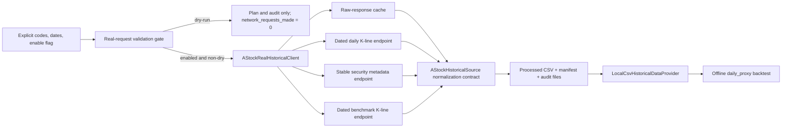

# Phase 3.2b-2c Small Real A-Stock-Data Request Validation Design

## Status And Purpose

This document defines the next bounded experiment after the accepted mocked
historical source contract:

```text
explicit 1-3 codes and short date range
  -> explicitly enabled real historical preparation request
  -> cached raw responses and audited processed CSV files
  -> offline daily_proxy backtest
```

This phase is **design only**. Writing this specification does not implement
a real client and does not issue a real request.

The goal of Phase 3.2b-2c is to verify that a very small, user-authorized
historical request can pass through the same auditable preparation boundary
proven in Phase 3.2b-2b. It is not intended to produce trades, validate
strategy profitability, or broaden the research universe.

Prepared results remain:

```text
DAILY_PROXY only
NOT_STRICT_HISTORICAL
not evidence of strategy profitability
```

## Non-Goals And Prohibitions

Phase 3.2b-2c does not permit:

- default or implicit network access;
- full-market collection or discovery of an unrequested stock universe;
- more than three codes in the first real-request validation;
- networking from `run_backtest.py` or within a backtest loop;
- current live quote, current hotspot, or current capital-flow values written
  into historical dates;
- live scan adapter fallback, demo fallback, or positive sample-fixture
  fallback for a failed real source;
- automatic order placement, broker API execution, or broker-software clicks;
- GUI work, machine learning, or parameter brute-force optimization.

## Design Decision

Three approaches were considered:

| Approach | Shape | Assessment |
| --- | --- | --- |
| A. Explicit gated real client behind the existing preparation boundary | Add an enable flag, hard real-request limits, caching and audit; backtest consumes only local processed files | Selected: smallest extension of the proven mock contract and easiest to audit |
| B. Enable real fetching whenever `--source a-stock-data` is selected | Simpler CLI, but an accidental non-dry invocation could access external data | Rejected: network use would no longer be an explicit user action |
| C. Add fetching to the historical provider during backtest | Fewer preparation steps | Rejected: destroys offline reproducibility and future-data reviewability |

The selected approach is **A**. The existing mock-only source remains the
contract test boundary. A real historical client may be constructed only
after an explicit CLI enable flag and all bounded-request checks pass.

## Command Contract

### Explicit Enable Flag

The proposed real validation command is:

```text
python overnight_quant/scripts/prepare_backtest_data.py \
  --source a-stock-data \
  --enable-real-astock-request \
  --codes 600519 \
  --start 2025-01-01 \
  --end 2025-01-10 \
  --out-dir overnight_quant/backtest_data/processed \
  --max-codes 1 \
  --sleep 0.5 \
  --overwrite
```

New flag:

```text
--enable-real-astock-request
```

Rules:

1. No real historical client is constructed without this flag.
2. A valid non-dry CLI request without the flag returns:

   ```text
   REAL_NETWORK_NOT_ENABLED
   ```

   `REAL_NETWORK_DISABLED_IN_PHASE_3_2B_2B` remains the accepted Phase
   3.2b-2b mocked-only status; the new error code names the 2c opt-in
   contract more accurately.
3. `--dry-run --enable-real-astock-request` validates the real-request plan,
   including the stricter limits, but makes zero network requests and writes
   no processed dataset or cache response.
4. README text and preparation reports state that real requests are
   experimental, small-scale historical preparation only and are never the
   default behavior.
5. Internal tests may inject a fake real client only through an explicit test
   seam. Injection does not enable network code in a test run.

### Argument Behavior

| Argument | Real-Request Contract |
| --- | --- |
| `--source a-stock-data` | Selects the historical preparation source family |
| `--enable-real-astock-request` | Required to construct or call a concrete real client |
| `--codes` / `--codes-file` | One is required; only the exact normalized supplied codes may be requested |
| `--start` / `--end` | Both required; inclusive historical interval |
| `--out-dir` | Refuses a non-empty target unless `--overwrite` is specified |
| `--max-codes` | When real request is enabled, defaults to `3`; may reduce but cannot raise the hard real limit |
| `--sleep` | Minimum `0.2` seconds; `0.5` seconds recommended for manual validation |
| `--dry-run` | Performs validation and plan reporting only; zero source calls |
| `--no-cache` | Optional explicit refresh behavior; never disables pacing or auditing |

Recommended symbols for a future manual check are `600519`, `300750`, and
`510300`, but the code must not embed or automatically choose them. Users
must supply every code explicitly.

## Validation Order And Hard Limits

### Constants

The 2b mock-contract maximum remains available for mock-only validation:

```text
LIVE_PREP_HARD_MAX_CODES = 10
```

The new real-request limits are stricter:

```text
REAL_REQUEST_HARD_MAX_CODES = 3
REAL_REQUEST_MAX_DAYS = 31
ASTOCK_MIN_SLEEP_SECONDS = 0.2
```

When `--enable-real-astock-request` is present:

```text
effective_real_request_max_codes =
    min(user_max_codes_or_3, REAL_REQUEST_HARD_MAX_CODES)
```

If normalized input code count exceeds that effective maximum, return:

```text
MAX_CODES_EXCEEDS_REAL_REQUEST_LIMIT
```

No rejected request is truncated, reordered, retried with a subset, or
silently routed through the existing ten-code mock contract.

### Date Range Limit

The inclusive natural-day count is:

```text
requested_date_range_days = (end_date - start_date).days + 1
```

For an enabled real request, if this value exceeds `31`, return:

```text
DATE_RANGE_EXCEEDS_REAL_REQUEST_LIMIT
```

This limit is checked during enabled dry-run as well as enabled execution.

### Validation Precedence

Validation must complete before any real client construction or source call:

1. `CODES_REQUIRED` for missing explicit codes.
2. `DATE_RANGE_REQUIRED` for missing, invalid, or reversed dates.
3. `SLEEP_BELOW_MINIMUM` when `--source a-stock-data` uses a sleep value
   below `0.2`.
4. If real enable flag is present, enforce:
   - `MAX_CODES_EXCEEDS_REAL_REQUEST_LIMIT`;
   - `DATE_RANGE_EXCEEDS_REAL_REQUEST_LIMIT`.
5. Validate output overwrite rules.
6. For a non-dry request without enable flag, return
   `REAL_NETWORK_NOT_ENABLED`.
7. Only a non-dry, explicitly enabled, fully validated request may construct
   `AStockRealHistoricalClient`.

For a dry-run without the real enable flag, existing mock-safe
`a-stock-data` planning can remain subject to the accepted 2b contract. A
dry-run intended to validate the real experiment must include
`--enable-real-astock-request`, so the three-code and thirty-one-day limits
are unambiguous.

## Architecture



### Planned Component Boundaries

| Component | Responsibility | Important Restriction |
| --- | --- | --- |
| `scripts/prepare_backtest_data.py` | Parse enable flag and source-specific options; do not construct client before all gates pass | No implicit network |
| `backtest/data_preparation.py` | Validate limits, record opt-in status and audit metadata, preserve processed writer contract | Does not fetch data |
| `backtest/astock_historical_source.py` | Reuse accepted adapter/cache/normalization protocol | Does not import live scan adapter |
| `backtest/astock_real_historical_client.py` or equivalent focused module | Implement allowed historical endpoint requests only | Constructed only behind enable flag |
| `backtest/historical_data.py` | Consume processed files for `daily_proxy` | Remains entirely offline |
| `backtest/backtest_engine.py` | Existing event ordering, exits, fees and metrics | Unchanged by this phase |

The real client conforms to the client protocol already established by the
mocked adapter skeleton:

```python
class AStockRealHistoricalClient:
    def fetch_daily_bars(self, code, start, end): ...
    def fetch_stock_metadata(self, code): ...
    def fetch_benchmark_bars(self, symbol, start, end): ...
    def fetch_fund_flow(self, code, start, end): ...
```

In the first real validation, `fetch_fund_flow()` remains disabled or returns
an explicitly unsupported/unavailable result. Capital fields are not required
to exercise the data preparation boundary.

## Historical Data Source Boundary

The real client may admit only endpoints that yield dated historical values
or stable instrument metadata.

### Initially Admitted Sources

| Data Need | Candidate Source | Initial Use | Truth Treatment |
| --- | --- | --- | --- |
| Individual daily OHLCV/amount and dated MA values if supplied | Baidu historical daily K-line | Primary real-request endpoint to verify | `REAL_HISTORICAL` only for rows with requested historical dates |
| Listing date and stable instrument identity | Eastmoney stock metadata | Stable metadata enrichment | `REAL_HISTORICAL` stable metadata for `list_date`, with source disclosure |
| Benchmark historical daily bars | Baidu dated index K-line, only after response shape is verified | Create benchmark-direction proxy | Dated benchmark OHLC is `REAL_HISTORICAL`; derived market gate is `DAILY_PROXY` |

### Designed But Not Initially Enabled

| Candidate | Status | Reason |
| --- | --- | --- |
| mootdx daily bars fallback | Reserved optional fallback | May be added only after its response/date mapping and error behavior are tested separately |
| Eastmoney `push2his` dated capital flow | Reserved optional enhancement | May only populate capital fields when each row is date-matched and audited |

### Explicitly Forbidden Inputs

| Input | Reason It Is Not Admitted |
| --- | --- |
| Tencent current quote | Current quote cannot establish historical turnover, price limits or safety state |
| THS current hotspot / reason | Current topic attribution cannot be written onto historical selection dates |
| Live scan adapter output or its demo fallback | Breaks historical provenance and may silently substitute values |
| Positive fixture data | Test-only fixture values must never appear on real source paths |
| Current name-based ST inference | Current naming does not prove historical ST status on the requested date |

The real client module must not import `overnight_quant.data.astock_client`
if that import exposes live fallback behavior. Historical endpoint logic
belongs in a focused preparation-only client with its own tested contracts.

## Truth Levels And Field Strategy

Only these truth levels are admitted in real-request output:

```text
REAL_HISTORICAL
DAILY_PROXY
UNAVAILABLE
UNKNOWN
```

`SAMPLE_FIXTURE` remains prohibited for `source=a-stock-data` and is recorded
as such in the manifest rather than used as field data.

### Field Mapping

| Field | Permitted Origin In First Real Validation | Truth Level | Missing Behavior |
| --- | --- | --- | --- |
| `trade_date`, `open`, `high`, `low`, `close`, `volume`, `amount` | Dated accepted K-line row | `REAL_HISTORICAL` | Reject unusable row and audit source error |
| `code` | Explicit request identity | `REAL_HISTORICAL` identity | Malformed code rejected before request |
| `name` | Stable metadata or historical response identity | `REAL_HISTORICAL` metadata | Report missing coverage |
| `list_date` | Eastmoney stable metadata | `REAL_HISTORICAL` stable metadata | Blank and `UNKNOWN`; downstream rejects |
| `change_pct`, `ma5`, `ma10`, `ma20` if calculated locally | Historical daily rows at or before date | `DAILY_PROXY` | First-window gaps disclosed |
| `vol_ratio` | Historical volume divided by prior available volume window | `DAILY_PROXY` | Blank if window unavailable |
| `range_position` | Same-date daily OHLC formula | `DAILY_PROXY` | Blank if invalid range |
| `is_bj_stock` | Normalized code-prefix inference | `DAILY_PROXY` | Derive and disclose |
| `theme_tags`, `theme_rank` | Not reconstructed | `UNAVAILABLE` | Blank |
| `main_net`, `big_order_net` | Not enabled initially | `UNAVAILABLE` | Blank |
| `tail_pullback_pct` | No admitted minute snapshot source | `UNAVAILABLE` | Blank |
| `limit_up`, `limit_down` | Verified dated field only | `REAL_HISTORICAL` or `UNKNOWN` | Leave blank; downstream rejects |
| `is_st`, `is_suspended` | Verified dated field only | `REAL_HISTORICAL` or `UNKNOWN` | Leave blank; downstream rejects |

### Market Proxy

If accepted historical benchmark bars exist, preparation may generate:

```text
market_gate = benchmark_direction_proxy
market_proxy_used = true
```

The benchmark OHLC rows are `REAL_HISTORICAL`; the resulting market direction
and gate are `DAILY_PROXY`. This is not historical tail-session market
sentiment.

If no dated benchmark data is available, no market PASS row is invented.
Downstream `daily_proxy` remains in cash with `market_data_unavailable`.

## Safety Field Policy

Generating trades is not an acceptance condition for this phase. Safety
unknowns are expected and acceptable if honestly reported.

Rules:

- Do not calculate or import historical `limit_up` / `limit_down` unless the
  dated source contract proves their historical validity.
- Do not classify historical `is_st` from a current quote or current name.
- Do not classify historical `is_suspended` from current trading state.
- Use stable `list_date` metadata only with its attributed source and parsing
  success recorded.
- Derive `is_bj_stock` from the security code as a disclosed proxy.

Downstream rejection behavior remains conservative:

```text
limit_price_unknown
st_status_unknown
suspended_status_unknown
list_date_missing
bj_status_unknown   # only if code normalization cannot establish the proxy
```

A zero-trade real-request result may still successfully validate the
historical retrieval, caching, processing and offline consumption pipeline.

## Cache Policy

### Location

Real requests must use the ignored historical preparation cache:

```text
overnight_quant/backtest_data/cache/a_stock_data/
```

The cache is never committed.

### Default Behavior

- Cache is enabled by default for real preparation.
- A valid cache hit prevents a repeated source request.
- Newly fetched raw responses are cached before normalization so response
  parsing can be audited or replayed.
- A malformed or unreadable cache item records `CACHE_READ_FAILED` and may
  proceed to a bounded refetch when the request remains enabled.
- A source failure never triggers sample/demo fallback.

### Cache Key

The accepted 2b key contract continues:

```text
<source>/<endpoint_version>/<symbol>/<start>_<end>/<request_hash>.json
```

The request hash includes normalized endpoint parameters that affect the raw
response. It excludes local paths and credentials.

### Optional Refresh

An optional future `--no-cache` flag means:

- skip cache reads for that explicitly enabled bounded request;
- still write newly retrieved raw responses;
- still enforce rate limiting, retries and all hard limits.

The first manual verification should use default caching, not `--no-cache`.

## Rate Limiting And Retry Policy

| Policy | Rule |
| --- | --- |
| Minimum configured sleep | `ASTOCK_MIN_SLEEP_SECONDS = 0.2` |
| Recommended manual validation sleep | `0.5` seconds |
| Maximum real validation codes | `3` |
| Maximum inclusive date range | `31` natural days |
| Retry count | At most two retries after the initial call per endpoint/symbol |
| Retryable failures | timeout, connection interruption, HTTP 429, HTTP 5xx |
| Non-retryable failures | invalid input, invalid response structure, unsupported data semantics |
| Backoff | Respect minimum pacing; increase wait for each retry |
| Partial success | Keep accepted codes, write errors, return `PARTIAL_DATA_PREPARED` |
| Total daily-bar failure | Return `NO_DAILY_BARS_FETCHED` and no usable processed dataset |

Every actual outbound attempt, including retries, increments
`network_requests_made`.

## Manifest And Audit Requirements

### `dataset_manifest.yaml`

For a successful real preparation, the manifest records at least:

```yaml
source: a-stock-data
fidelity: daily_proxy
selection_as_of: daily_close_proxy
strict_historical_supported: false
real_request_enabled: true
requested_codes_count: 1
real_request_hard_max_codes: 3
effective_real_request_max_codes: 1
requested_date_range_days: 10
max_allowed_days: 31
network_prepared: true
backtest_network_access: false
network_requests_made: 0
cache_hits: 0
cache_writes: 0

truth_levels:
  REAL_HISTORICAL: dated source values or disclosed stable metadata
  DAILY_PROXY: calculations derived solely from admitted historical daily rows
  SAMPLE_FIXTURE: prohibited_for_a_stock_data
  UNAVAILABLE: no admitted historical source in this phase
  UNKNOWN: safety value not historically confirmed

warnings:
  - DAILY_PROXY_ONLY
  - NOT_STRICT_HISTORICAL
  - EXPERIMENTAL_SMALL_SCALE_REAL_HISTORICAL_PREPARATION
  - NO_CURRENT_LIVE_BACKFILL
  - NO_INTRADAY_TAIL_DATA_IF_APPLICABLE
  - NO_HISTORICAL_THEME_IF_APPLICABLE
  - NO_HISTORICAL_FUND_FLOW_IF_APPLICABLE
```

`network_requests_made` may be zero on successful preparation when every
required raw response is served from a valid cache.

### `prepare_report_*.md`

The preparation report includes:

1. `real_request_enabled: true/false`;
2. exact requested codes and `requested_codes_count`;
3. `real_request_hard_max_codes: 3`;
4. `effective_real_request_max_codes`;
5. requested date range, `requested_date_range_days`, and
   `max_allowed_days: 31`;
6. output and cache paths;
7. `network_requests_made`, `cache_hits`, and `cache_writes`;
8. per-source attempt/success/failure/cache-hit counts;
9. truth-level field coverage;
10. unavailable fields and unknown safety-field counts;
11. candidates or dates rejected because safety fields are unknown, when
    offline consumption has been run;
12. whether output is readable by offline `daily_proxy`;
13. a prominent statement that results are DAILY_PROXY only and not strict
    historical validation or evidence of profitability.

### `source_errors_*.csv`

Retain the accepted schema:

```text
code,source,stage,error_code,error_message,retry_count
```

Validation failures without network activity still write audit rows when
reports are generated. For example, an enabled real dry-run requesting four
codes records:

```text
source=a-stock-data
stage=validation
error_code=MAX_CODES_EXCEEDS_REAL_REQUEST_LIMIT
requested_codes_count=4
effective_real_request_max_codes=3
network_requests_made=0
```

## Error Codes

| Error Code | Condition | Network Allowed Before Result |
| --- | --- | --- |
| `CODES_REQUIRED` | No explicit usable codes | No |
| `DATE_RANGE_REQUIRED` | Missing, malformed, or reversed date range | No |
| `SLEEP_BELOW_MINIMUM` | `--sleep < 0.2` | No |
| `REAL_NETWORK_NOT_ENABLED` | Valid non-dry `a-stock-data` request without enable flag | No |
| `MAX_CODES_EXCEEDS_REAL_REQUEST_LIMIT` | Enabled real request exceeds effective maximum capped at `3` | No |
| `DATE_RANGE_EXCEEDS_REAL_REQUEST_LIMIT` | Enabled real request exceeds inclusive `31` natural days | No |
| `DATA_DIR_EXISTS_WITHOUT_OVERWRITE` | Output exists without explicit overwrite | No |
| `CACHE_READ_FAILED` | Cached raw response cannot be read or parsed | A bounded enabled refetch may follow |
| `HISTORICAL_DAILY_BAR_SOURCE_FAILED` | Dated bars fail or parse as unusable for one code | Other bounded codes may continue |
| `HISTORICAL_METADATA_FAILED` | Stable metadata retrieval or parsing fails | Daily rows may continue with safety unknown |
| `BENCHMARK_UNAVAILABLE` | No accepted dated benchmark bars | Dataset may write; market proxy unavailable |
| `NO_DAILY_BARS_FETCHED` | No code yields accepted daily bars | No valid processed dataset |
| `PARTIAL_DATA_PREPARED` | Some data accepted with audited source failures | Processed output written |
| `PREPARE_COMPLETED` | Bounded preparation completes with disclosed coverage | Processed output written |

## Future-Data And Offline Backtest Boundary

The following sequencing is mandatory:

1. Validate enable state, codes, dates, limits, pacing and output paths.
2. Fetch or load cache only in the preparation command.
3. Keep only accepted historical rows dated within the requested interval.
4. Attach only stable metadata or same-date admitted historical data.
5. Derive proxy fields only from the current date and earlier admitted daily
   bars.
6. Write processed files and audit reports.
7. Run `daily_proxy` separately against local processed output with no
   network access.

Forbidden transformations:

- selecting a candidate with future-date rows or `next_day_*` fields;
- writing current quote or current topic/capital state onto a past date;
- replacing failed real data with demo or positive fixture rows;
- clearing safety unknowns merely to make the backtest trade.

## Test Design Before Any Real Manual Run

Implementation must first pass fake-real-client tests. These tests inject a
client that acts like a real source contract but never performs networking.

| Test | Expected Proof |
| --- | --- |
| `test_astock_real_request_requires_enable_flag` | Non-dry source without the enable flag returns `REAL_NETWORK_NOT_ENABLED` and creates no real client |
| `test_astock_enabled_dry_run_makes_zero_requests` | Enable flag plus dry-run validates planning only; network call counter remains zero |
| `test_astock_real_request_rejects_more_than_three_codes` | Returns `MAX_CODES_EXCEEDS_REAL_REQUEST_LIMIT`, records requested/effective counts and makes zero calls |
| `test_astock_real_request_rejects_more_than_31_days` | Returns `DATE_RANGE_EXCEEDS_REAL_REQUEST_LIMIT` without constructing or calling a client |
| `test_fake_real_client_prepares_processed_dataset` | Accepted dated fake-real responses produce processed files and a real-request audit shape |
| `test_real_source_cache_hit_avoids_second_fake_request` | Cached raw response is reused; call counter does not increase |
| `test_real_source_keeps_theme_capital_tail_unavailable` | No live or fixture enrichment appears in processed data or manifest |
| `test_real_source_missing_safety_fields_reject_downstream_buy` | Blank safety fields remain `UNKNOWN` and appear in daily-proxy rejections |
| `test_real_prepared_data_is_consumed_offline` | `daily_proxy` reads processed data, creates only backtest output, and performs zero preparation requests during the run |
| `test_real_client_module_does_not_import_live_or_execution_capabilities` | No live adapter, current quote fallback, click automation or order execution dependency is introduced |

In addition, endpoint parsing tests must use stored or inline fixture
responses before any real endpoint invocation is reviewed. Tests never send
real network requests.

## Manual Real-Request Verification Sequence

Only after this design is approved, an implementation plan is approved, and
fake-real-client tests pass may an operator run a real bounded validation:

```text
python overnight_quant/scripts/prepare_backtest_data.py \
  --source a-stock-data \
  --enable-real-astock-request \
  --codes 600519 \
  --start 2025-01-01 \
  --end 2025-01-10 \
  --out-dir overnight_quant/backtest_data/processed \
  --max-codes 1 \
  --sleep 0.5 \
  --overwrite
```

Then, as a separate offline command:

```text
python overnight_quant/scripts/run_backtest.py \
  --dataset local \
  --fidelity daily_proxy \
  --data-dir overnight_quant/backtest_data/processed
```

The manual acceptance review checks:

- enabled request count and date-range audit;
- raw cache presence and ignored Git state;
- endpoint errors and retry counts;
- field coverage, unavailable enhancements and unknown safety fields;
- offline `daily_proxy` readability;
- report language retaining `DAILY_PROXY` / `NOT_STRICT_HISTORICAL`;
- absence of changes in real/example trading records and reports.

No real request is part of this design-spec turn.

## Intended Implementation Stages

Phase 3.2b-2c should proceed only through explicit review gates:

1. **Design**: approve this document; no code or request.
2. **Implementation plan**: specify exact files, tests and endpoint response
   fixtures; no request.
3. **Fake-real implementation**: implement enable/limit/cache/client
   boundaries and response parsers under tests only; no request.
4. **Manual one-code request approval**: run one explicitly approved short
   request and review its audit output.
5. **Optional two-to-three code observation**: only after the one-code
   output is accepted; still no broad collection.

## Acceptance Criteria For This Design

- A real historical request requires an explicit
  `--enable-real-astock-request` flag.
- The first real validation is hard-limited to three explicit codes and an
  inclusive maximum of thirty-one natural days.
- Enabled dry-run enforces those limits while making zero requests.
- Historical endpoint admission is narrow and excludes current/live
  backfill, sample fixture fallback and live adapter imports.
- Safety unknowns are preserved and may result in zero trades.
- Cache, network-count, field-truth and source-error audit behavior are
  specified.
- Prepared files may be consumed only through the existing offline
  `daily_proxy` flow.
- Automated trading, broker clicking, GUI, ML, broad collection and
  `strict_historical` claims remain prohibited.
